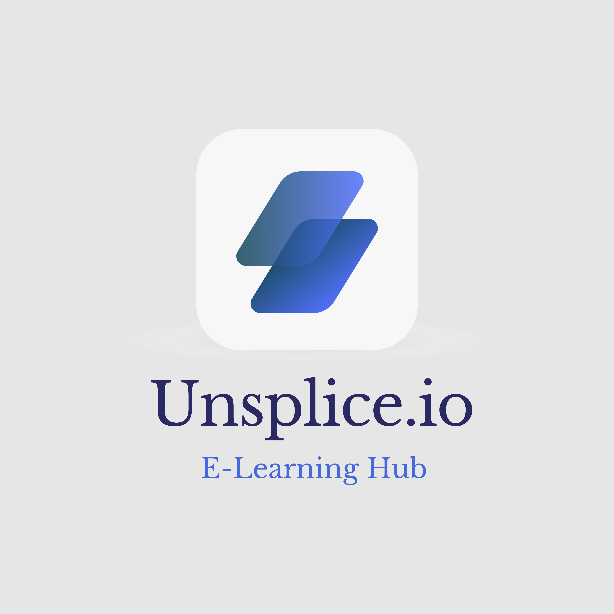

# Unsplice.io

E-learning management system to help bridge online interaction between teacher and student.

## Project Description

<!-- PROJECT LOGO -->
<br />
<div align="center">
  <a href="https://github.com/abrielequdsi/unsplice.io/blob/developement/main_logo.png">
    
  </a>

<h3 align="center">Unsplice.io</h3>

  <p align="center">
    unsplice.io is a one-stop E-Learning Platform or course management system (CMS) with aims to help educators create effective online education by helping them conceptualising various courses content, course structures, and curriculum.
    <br />
    <br />
  </p>
</div>

## Tech Stack

**`Front End:`**

- React
- Redux
- Material UI
- Apollo Client
- Axios

`Back End:`

- GraphQL
- Apollo Server
- Express
- MongoDB (Mongoose)
- JWT Auth

`API`

- Notion API

<!-- INSTALLATION -->
## Installation

1. Clone the repo
   ```
   git clone https://github.com/abrielequdsi/unsplice.io.git
   ```
2. Create an config.js file in the client folder and one in the server folder, using as template the .config.js example file
3. Create a MongoDb database
4. Install the packages running npm install both in the client and in the server folder
5. Run the application:
   ```
   unsplice.io/client % npm start
   ```
   ```
   unsplice.io/server % npm start start
   ```


<!-- CONTRIBUTING -->
## Contributing

Contributions are what make the open source community such an amazing place to learn, inspire, and create. Any contributions you make are **greatly appreciated**.

If you have a suggestion that would make this better, please fork the repo and create a pull request. You can also simply open an issue with the tag "enhancement".
Don't forget to give the project a star! Thanks again!

1. Fork the Project
2. Create your Feature Branch (`git checkout -b feature/AmazingFeature`)
3. Commit your Changes (`git commit -m 'Add some AmazingFeature'`)
4. Push to the Branch (`git push origin feature/AmazingFeature`)
5. Open a Pull Request

<p align="right">(<a href="#top">back to top</a>)</p>